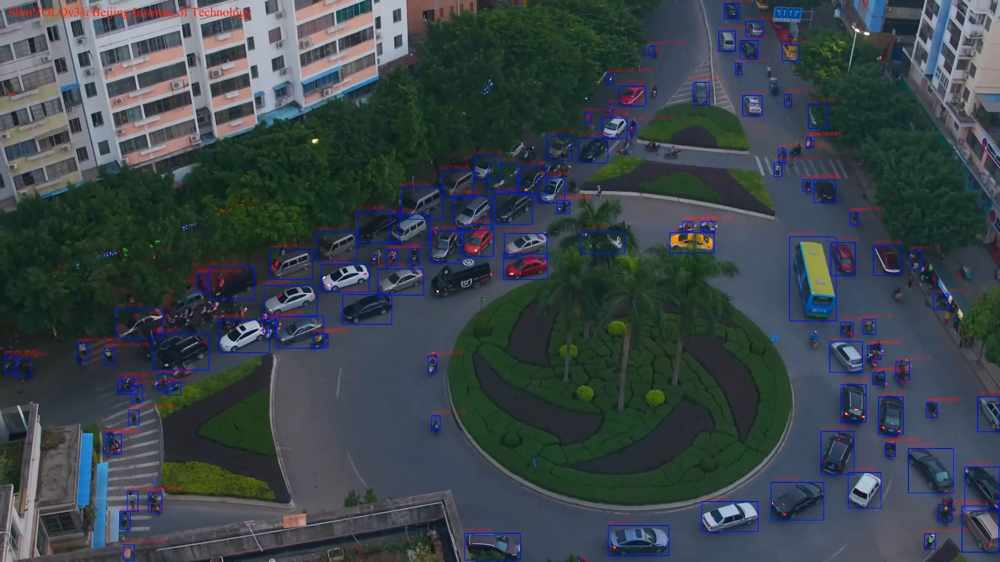

# SlimYOLOv3: Narrower, Faster and Better for UAV Real-Time Applications

This page is for the [SlimYOLOv3: Narrower, Faster and Better for UAV Real-Time Applications](http://arxiv.org/abs/1907.11093)


## Abstract

Drones or general Unmanned Aerial Vehicles (UAVs), endowed with computer vision function by on-board cameras and embedded systems, have become popular in a wide range of applications. However, real-time scene parsing through object detection running on a UAV platform is very challenging, due to the limited memory and computing power of embedded devices. To deal with these challenges, in this paper we propose to learn efficient deep object detectors through performing channel pruning on convolutional layers. To this end, we enforce channel-level sparsity of convolutional layers by imposing L1 regularization on channel scaling factors and prune less informative feature channels to obtain “slim” object detectors. Based on such approach, we present SlimYOLOv3 with fewer trainable parameters and floating point operations (FLOPs) in comparison of original YOLOv3 (Joseph Redmon et al., 2018) as a promising solution for real-time object detection on UAVs. We evaluate SlimYOLOv3 on VisDrone2018-Det benchmark dataset; compelling results are achieved by SlimYOLOv3-SPP3 in comparison of unpruned counterpart, including ~90.8% decrease of FLOPs, ~92.0% decline of parameter size, running ~2 times faster and comparable detection accuracy as YOLOv3. Experimental results with different pruning ratios consistently verify that proposed SlimYOLOv3 with narrower structure are more efficient, faster and better than YOLOv3, and thus are more suitable for real-time object detection on UAVs.


## Demo

[](results/demo.mp4)


## Requirements

1. pytorch >= 1.0

2. [darknet](https://pjreddie.com/darknet/yolo/)

3. [ultralytics/yolov3](https://github.com/ultralytics/yolov3)

## Procedure of learning efficient deep objectors for SlimYOLOv3


### 1. Normal Training

    ./darknet/darknet detector train VisDrone2019/drone.data  cfg/yolov3-spp3.cfg darknet53.conv.74.weights

### 2. Sparsity Training

    python yolov3/train_drone.py --cfg VisDrone2019/yolov3-spp3.cfg --data-cfg VisDrone2019/drone.data -sr --s 0.0001 --alpha 1.0

### 3. Channel Prunning

    python yolov3/prune.py --cfg VisDrone2019/yolov3-spp3.cfg --data-cfg VisDrone2019/drone.data --weights yolov3-spp3_sparsity.weights --overall_ratio 0.5 --perlayer_ratio 0.1


### 4. Fine-tuning

    ./darknet/darknet detector train VisDrone2019/drone.data  cfg/prune_0.5.cfg weights/prune_0.5/prune.weights


## Test

### Pretrained models

#### 1. baseline models

(1) GoogleDrive [yolov3-tiny_final.weights](https://drive.google.com/open?id=1Wf-vczUgdA-LrqYQE23k5jtOGkX_Hwzd) 

BaiduDisk [yolov3-tiny_final.weights](https://pan.baidu.com/s/11wbny1d7dXpCW2gb0VwQkA)(8hu4) 

(2) [yolov3_final.weights](https://drive.google.com/open?id=1zmbQDverpFYm2D_timtNmmMEIlZUxIMd)

BaiduDisk [yolov3_final.weights](https://pan.baidu.com/s/1J7_IJy5xKnUkRyemz8X9Yg)(kamf)

(3) [yolov3-spp1_final.weights](https://drive.google.com/open?id=1ocImqkS5HgckHQHTfCQAPr0WzZb6V68J)

BaiduDisk [yolov3-spp1_final.weights](https://pan.baidu.com/s/17qLPzopTgziVDmDDsohO2w)(9e6z)

(4) [yolov3-spp3_final.weights](https://drive.google.com/open?id=1A7ow3WdVhUBW5Ai9mf2mvU5Xfqn1FnI2)

BaiduDisk [yolov3-spp3_final.weights](https://pan.baidu.com/s/1uoEwttBmD2a_L3LAui0SyA)(5s7s)


#### 2. iter1-pruning

(1) [prune_0.5_final.weights](https://drive.google.com/open?id=1mLthX9kf1KPAw3Yv3qxUH2Qo6vuEO4PZ)

BaiduDisk [prune_0.5_final.weights](https://pan.baidu.com/s/1Ed7_LptMsWgjKVTuPgvKmg)(eqgh)


(2) [prune_0.9_final.weights](https://drive.google.com/open?id=1FYgCxlvFsu_eFzA8xB4V4da1qwmhFkKH)

BaiduDisk [prune_0.9_final.weights](https://pan.baidu.com/s/1IAkqs7WB1m-8RfmF9wCIEA)(ysx9)

(3) [prune_0.95_final.weights](https://drive.google.com/open?id=1qY2Rp7BO33A046iOLGfu6Sdij5oKBAoY)

BaiduDisk [prune_0.95_final.weights](https://pan.baidu.com/s/1MnQPGv_MAuzqL5G-Saw2Fw)(1gmn)


#### 3. iter2-pruning

(1) [prune_0.5_0.5_final.weights](https://drive.google.com/open?id=1q0xUniQFycnggDAiolQtlDFt-_VEZlQg)


BaiduDisk [prune_0.5_0.5_final.weights](https://pan.baidu.com/s/1arKqSBFx1ib9jQtfzGnoRg)(7sea)

#### 4. iter3-pruning

(1) [prune_0.5_0.5_0.7_final.weights](https://drive.google.com/open?id=1NRchetH5RaiPY0KSfAaDIy6t4DvnAVXr)

BaiduDisk [prune_0.5_0.5_0.7_final.weights](https://pan.baidu.com/s/1h8SQUf-iJE8tQaSuiUmLfg)(g8ku)

### Use darknet for evaluation

    ./darknet/darknet detector valid VisDrone2019/drone.data cfg/prune_0.5.cfg backup_prune_0.5/prune_0_final.weights

### Use pytorch for evaluation

    python3.6 yolov3/test_drone.py --cfg cfg/prune_0.5.cfg --data-cfg VisDrone2019/drone.data --weights backup_prune_0.5/prune_0_final.weights --iou-thres 0.5 --conf-thres 0.1 --nms-thres 0.5 --img-size 608

    python yolov3/test_single_image.py --cfg cfg/yolov3-tiny.cfg --weights ../weights/yolov3-tiny.weights --img_size 608 


## Citation

If you find this code useful for your research, please cite our paper:

```
@article{
  author    = {Pengyi Zhang, Yunxin Zhong, Xiaoqiong Li},
  title     = {SlimYOLOv3: Narrower, Faster and Better for Real-Time UAV Applications},
  journal   = {CoRR},
  volume    = {abs/1907.11093},
  year      = {2019},
  ee        = {https://arxiv.org/abs/1907.11093}
}

```